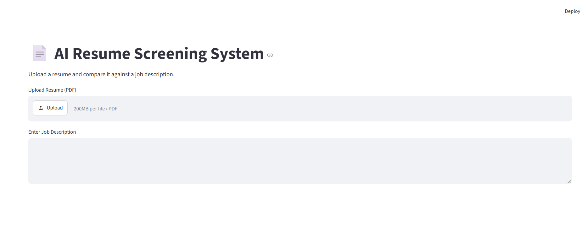
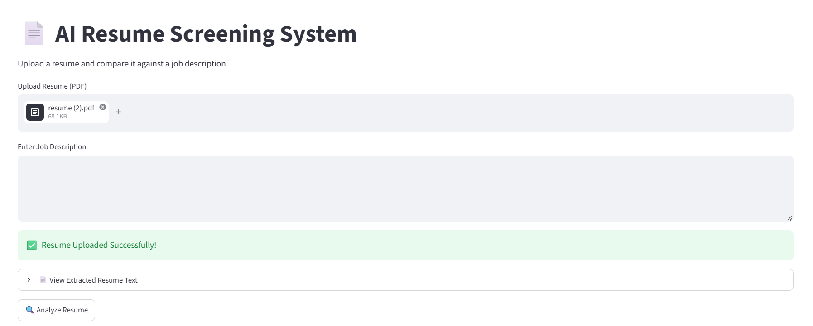

# 📄 AI Resume Screening System

An AI-powered Resume Screening System built using Python, Streamlit, PDFPlumber, and Scikit-learn.

This application helps recruiters and job seekers by analyzing resumes against job descriptions, calculating ATS scores, identifying skill gaps, and generating interview questions.

---

## 🚀 Features

✅ Upload Resume PDF

✅ Extract Resume Text Automatically

✅ Job Description Matching

✅ Resume Match Score using TF-IDF & Cosine Similarity

✅ ATS Score Calculation

✅ Matched Skills Detection

✅ Missing Skills Detection

✅ Resume Strength Analysis

✅ Resume Improvement Suggestions

✅ AI-Based Interview Question Generation

---

## 🛠️ Technologies Used

- Python
- Streamlit
- PDFPlumber
- Scikit-learn
- TF-IDF Vectorization
- Cosine Similarity
- NLP Concepts

---

## 📷 Project Screenshots

### Home Page



---

### Resume Upload



---

### Analysis Results


---

### ATS Score and Skill Analysis


---

## 📊 Sample Output

### Resume Match Score

```text
34.07% Match
```

### ATS Score

```text
90/100
```

### Matched Skills

```text
Python
SQL
Machine Learning
Data Analysis
REST API
```

### Missing Skills

```text
AWS
Docker
```

---

## 📂 Project Structure

```text
AI_Resume_Screener
│
├── screenshots/
│   ├── home.png
│   ├── upload.png
│   ├── analysis.png
│   └── ats_score.png
│
├── app.py
├── requirements.txt
├── README.md
├── .gitignore
└── .venv
```

---

## ⚙️ Installation

Clone the repository:

```bash
git clone https://github.com/amruthacs2005/AI_Resume_Screener.git
```

Move into the project directory:

```bash
cd AI_Resume_Screener
```

Install dependencies:

```bash
pip install -r requirements.txt
```

Run the application:

```bash
streamlit run app.py
```

---

## 🎯 Future Enhancements

- Multiple Resume Ranking
- AI Resume Feedback using LLMs
- Resume Keyword Optimization
- Experience Analysis
- Advanced ATS Scoring
- Candidate Recommendation Engine

---

## 👩‍💻 Author

### Amrutha C S

Information Technology Student

Python | Machine Learning | Data Analysis | AI Development

GitHub:
https://github.com/amruthacs2005

LinkedIn:
https://linkedin.com/in/c-s-amrutha-0121b1315

---

## ⭐ If you like this project

Please consider giving it a Star on GitHub.